# AI Chinese Cloud · 学生与教师用例及角色流程图

> 版本：v1.0（2026-09-28）
> 范围：学生学习端（移动端课堂原型 + 后台学生视角）、教师工作台；教学管理与系统作为支撑角色。

---

## 1. 术语与概念

### 1.1 核心层级

| 名词 | 所属层级 | 定义 | 例子 |
| --- | --- | --- | --- |
| 主题 | 内容层 | 内容主线，决定整套课程围绕什么展开 | 餐厅中文、HSK1级、职场速成中文 |
| 课节 | 内容层 | 具体“学什么”的内容单元，可以给不同课次复用 | 在餐厅点餐、口味表达、结账付款 |
| 系列班 | 交付层 | 同一主题下多个课节组成的整套课程，按整套报名 | 餐厅中文四周系列大班课 |
| 单次班 | 交付层 | 不属于系列班的独立开课，按单个课次报名 | 问候口语大班课 |
| 课次 | 交付层 | 某个课节给某个班级、在某个时间上的一次课 | 点餐课 · 7 年级 A 班 · 周三 19:00 |
| 稳定班级 | 教学对象层 | 长期存在的学生组织，班级改名不影响历史数据 | 印尼圣心学校 7 年级 A 班、周三晚 A 班 |

**关键公式**

- 课次 = 课节 × 稳定班级 × 上课时间
- 同一个课节给两个班各上一次 = 两个课次
- 系列班 = 同一主题下的一组课节 + 这些课节排出的课次
- 单次班 = 不组成系列的独立课次
- 课节是内容，可以复用；课次是交付，每次上课独立产生名单、作答和成绩

### 1.2 层级关系图

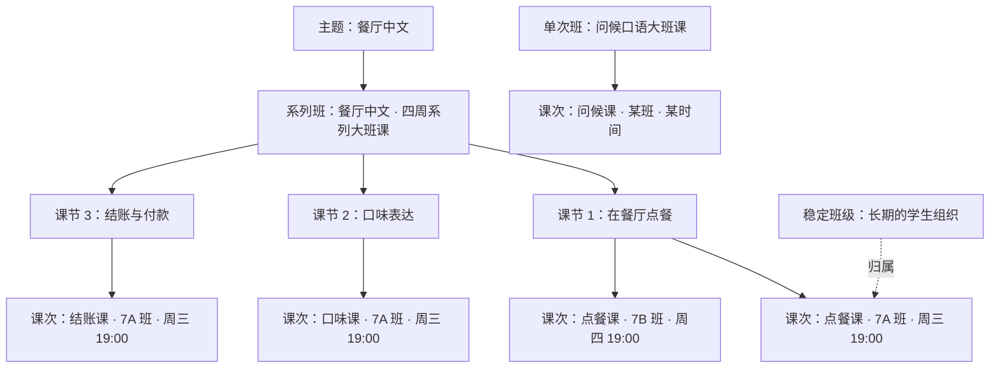

### 1.3 报名与学习术语

| 名词 | 定义 | 关键点 |
| --- | --- | --- |
| 预约 | 学生对某个课次的占位记录 | 状态：已预约 / 待审核 / 已取消 |
| 待审核 | 需要教学管理审核的报名状态 | 审核通过后才占名额并加入班级；原型已具备状态，审核通过入口待补 |
| 候补 | 满员后排队等待名额的记录 | 单次班按课次排队；系列班按整套排队 |
| 自动转正 | 有空位释放时，系统按排队顺序把候补转为正式预约 | 系列班要求整套课次都有位置才会一起转正 |
| 阶段 | 一次课次的学习时间段 | 课前预习、课中、课后复习 |
| 开放时间 | 阶段允许学生进入的时间 | 课前默认提前 48 小时开放；课后默认开放 48 小时 |
| 学生时间冲突 | 学生已预约的其他课次与目标课次时间重叠 | 预约时校验；教学管理强制代约可以覆盖 |

### 1.4 教学内容术语

| 名词 | 定义 | 关键点 |
| --- | --- | --- |
| 材料 | 课件、PDF、音频、视频、图片、外链等共享资源 | 材料本身不属于某个课节和课次，都放材料库里 |
|  |
| 材料引用 | 决定材料出现在哪个课节的哪个阶段、哪些课次 | 支持“全部课次”“指定课次”“排除某个课次” |
| 互动设计 | 一组互动题目 + 所属课节 + 阶段 + 发布状态 | 可配置到指定课次 |
| 互动题目 | 互动设计里的单个题目 | 目前共 18 种题型 |
| 互动模板 | 预制好的互动题目 | 当前共18 种题型 × 14 个主题 × 3 个难度，共 756 套 |
|  |
| 作答记录 | 学生一次互动作答的结果 | 含得分、最好成绩、尝试次数、用时、错题 |

### 1.5 成绩术语

| 名词 | 定义 | 关键点 |
| --- | --- | --- |
| 互动练习 | 学生完成互动产生的结果 | 纯投票和语音占位默认不计入成绩 |
| 作业 / 考试 | 作业是作业系统、考试是考试系统 | 教学管理发布考核并锁定班级名单 |
|  |
| 成绩记录 | 每个学生在一次互动/作业/考试中的成绩 | 状态：待录分 / 已录分 / 缺考 / 免考 |
| 成绩权重 | 互动、作业、考试在综合成绩中的占比 | 这个可以配 |
| 综合成绩 | 按有效成绩类别归一化后的总成绩 | 学生看自己，教师看所教学生 |
| 最好成绩 | 同一互动在统计区间内的最高分 | 重复作答按最好成绩计入 |

### 1.6 容易混的概念

| 容易混淆 | 区分 |
| --- | --- |
| 主题 vs 系列班 | 主题是内容主线，系列班是按主题排出的整套课程 |
| 系列班 vs 课节 | 系列班是整套课程，课节是其中的一课 |
| 课节 vs 课次 | **课节是“某节课设计好学什么内容”，课次是“给哪个班、什么时候上”** |
| 课次 vs 单次班 | 单次班是独立课次开课、按次报名；报名对象就是某个课次 |
| 稳定班级 vs 课次 | 稳定班级是“谁和谁一起学”，课次是“这个班在某个时间上某个课节” |
| 预约 vs 候补 vs 待审核 | 有名额叫预约，满员排队叫候补，需审核叫待审核 |
| 课次 vs 班次 | 界面里的“班次”基本等同课次；文档统一用“课次” |

---

## 2. 角色与参与者

| 角色 | 主要界面 | 核心职责 |
| --- | --- | --- |
| 学生 | 移动学习端 + 后台学生视角 | 在移动端完成互动，在后台约课、候补、看课表、学材料、看成绩 |
| 教师 | 管理后台 | 看课表与名单、课堂设计、上课、复盘、看成绩、提交调课申请 |
| 教学管理 | 管理后台 | 设置课程目录与课节、排课、系列班、报名审核与代操作、内容治理、考核与成绩权重、审计 |
| 系统 | 后台机制 | 校验预约条件、候补自动转正、阶段窗口开放与关闭、成绩汇总 |

> 学生和教师是本文重点；教学管理和系统作为支撑角色出现在用例清单和泳道图里。

---

## 3. 用例清单

### 3.1 用例总览图

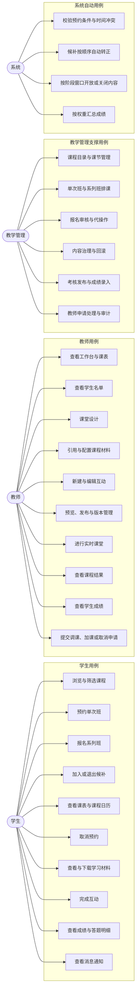

### 3.2 学生用例清单

| 编号 | 用例 | 前置条件 | 主流程要点 | 关键分支与异常 |
| --- | --- | --- | --- | --- |
| UC-S01 | 登录与偏好设置 | 已选择演示账号 | 选择角色、语言；进入对应工作区 | 时区影响展示时间，一般可以自动选不需要手选 |
| UC-S02 | 浏览与筛选课程 | 已登录学生 | 约课中心分单次班、系列班；按日期、目录、教师、关键词筛选 | 无匹配结果 |
| UC-S03 | 查看课程详情 | 已选中班次 | 查看时间、余位、预约截止、审核要求、预习材料 | 系列班查看整套课节与课次 |
| UC-S04 | 预约单次班 | 班次已发布 | 校验截止时间、重复预约、学生时间冲突、容量后报名 | 成功 / 满员转候补 / 需审核转待审核 / 时间冲突 / 已过截止 |
| UC-S05 | 报名系列班 | 系列班已发布 | 整套报名；系统对系列内每个课次生成预约 | 任一次课满员则整套候补；已有预约不可重复报名 |
| UC-S06 | 加入或退出候补 | 目标班次或系列已满 | 加入候补；可在候补队列中退出 | 释放空位后按排队顺序自动转正；系列班整套转正 |
| UC-S07 | 查看课表与课程日历 | 已加入该课程 | 即将开始、历史课程、课程日历 | 待审核课程单独展示且不占名额 |
| UC-S08 | 取消预约 | 在取消截止时间前 | 取消单次预约或整套系列预约，释放名额 | 超过学生自主取消截止需联系教学管理；取消后触发候补转正 |
| UC-S09 | 查看与下载学习材料 | 已预约且阶段开放 | 按课前、课中、课后查看课件与材料 | 未预约锁定；未到开放时间锁定；已下架材料不可见 |
| UC-S10 | 完成互动 | 已预约且阶段开放 | 选择互动、答题提交、记录得分、用时、尝试次数与错题 | 重练保留历史并更新最好成绩；纯投票和语音占位默认不计入成绩 |
| UC-S11 | 查看成绩与答题明细 | 已有互动或考核成绩 | 按 7 天、30 天、90 天或自定义范围查看综合、分项、趋势、技能雷达、明细 | 待公布成绩单独提示；学生只能看到自己的数据 |
| UC-S12 | 查看消息通知 | 已登录 | 查看预约、候补、内容更新、预习复习通知等消息 | 点击跳转对应页面并标记已读 |
| UC-S13 | 逐关完成移动端课中互动 | 移动端课堂页打开 | 从课堂页选一关 → 完成 → 弹出本关恭喜 → 返回课堂页 → 再选下一关；全部完成后课堂页再展示总恭喜 | 课堂模式记账；体验模式不记账；当前课堂页为本地试点数据 |

### 3.3 教师用例清单

| 编号 | 用例 | 前置条件 | 主流程要点 | 关键分支与异常 |
| --- | --- | --- | --- | --- |
| UC-T01 | 登录与工作台 | 教师已注册登录 | 查看今日排课、下一节课、最近添加内容、满班率与完成率 | 今天没有排课时提示继续准备内容 |
| UC-T02 | 查看课表与课程日历 | 已有排课 | 未来、历史、全部课次；月历视图 | 排课由教学管理维护 |
| UC-T03 | 查看学生名单 | 已有课次 | 查看预约名单与班级 | 只读，不展示学生联系方式 |
| UC-T04 | 课堂设计 | 已进入某个课次 | 按课前、课中、课后配置内容 | 内容挂在课节上，通过课次范围决定出现在哪些课次 |
| UC-T05 | 引用与配置课程材料 | 材料库已有材料 | 从材料库引入；配置阶段与适用课次；预览；移出 | 新版本不覆盖历史版本；删除下架材料不展示给学生（？需讨论） |
| UC-T06 | 新建与编辑互动 | 已选择课节与阶段 | 使用 18 类题型新建；从模板库引用；配置题目与是否计分 | 当前模板库 18 × 14 × 3 = 756 套 |
| UC-T07 | 预览、发布 | 互动已编辑完成 | 互动预览、保存并发布、配置课次、排除课次、查看版本历史、回滚 | - |
| UC-T08 | 进行实时课堂 | 进入进行中的课次 | 查看课件、查看互动进度、投影原题、正确率、平均分、排名、课堂动态 | 互动分未开始、进行中、已完成 |
| UC-T09 | 查看课程结果 | 课次已有作答 | 按内容看全班完成情况，定位薄弱环节；按学生看完成详情 | 无作答时显示空状态 |
| UC-T10 | 查看学生成绩 | 学生已有成绩 | 按时间与班级筛选；看学生汇总、互动、作业、考试；按学生或按内容查看；按题目分析 | 当前原型由教学管理发布考核并录入成绩，教师端以查看与分析为主 |
| UC-T11 | 提交调课、加课或取消申请 | 已有课次 | 选择课次与申请类型，填写原因后提交 | 教师不直接改排课；教学管理处理并回执，结果进入消息中心 |
| UC-T12 | 查看消息通知 | 已登录 | 查看预约名单变化、调课结果、内容更新等消息 | 点击跳转对应页面并标记已读 |

### 3.4 教学管理支撑用例（这块可以先不看）

| 编号 | 用例 | 说明 |
| --- | --- | --- |
| UC-O01 | 维护课程目录与课节 | 不限层级的目录树；创建课节并排课 |
| UC-O02 | 创建单次班与系列班 | 系列班选择同一主题下的多个课节；AI 按首节课时间与间隔预排课次时间，可逐节调整；校验教师时间冲突 |
| UC-O03 | 报名审核与代操作 | 待审核报名、代理预约、候补、改约、取消；强制操作需填写原因 |
| UC-O04 | 学生档案与班级成员 | 学生偏好、进度、稳定班级与成员关系 |
| UC-O05 | 内容治理 | 查看与回滚教师发布的互动；下架或恢复课程材料 |
| UC-O06 | 考核与成绩 | 发布作业、考试；录入成绩、缺考、免考；维护分版本成绩权重 |
| UC-O07 | 教师申请处理 | 处理改期、加课、新增课节、换老师、取消等申请 |
| UC-O08 | 审计与消息 | 记录强制操作与回滚，发送处理结果通知 |

### 3.5 系统自动用例（这块可以先不看 后面完善）

| 编号 | 用例 | 触发条件 | 结果 |
| --- | --- | --- | --- |
| UC-Y01 | 校验预约条件 | 学生发起预约 | 校验截止时间、重复预约、时间冲突、容量、审核要求 |
| UC-Y02 | 候补自动转正 | 有预约被取消或名额释放 | 按排队时间顺序转正；系列班整套有位置才转正 |
| UC-Y03 | 阶段窗口开放与关闭 | 到达开放或关闭时间 | 课前提前 48 小时开放；课后开放 48 小时 |
| UC-Y04 | 成绩汇总 | 互动提交或考核录分 | 按成绩权重归一化，生成综合成绩与趋势 |

---
## 4. 学生角色流程图

### 4.1 学生主流程

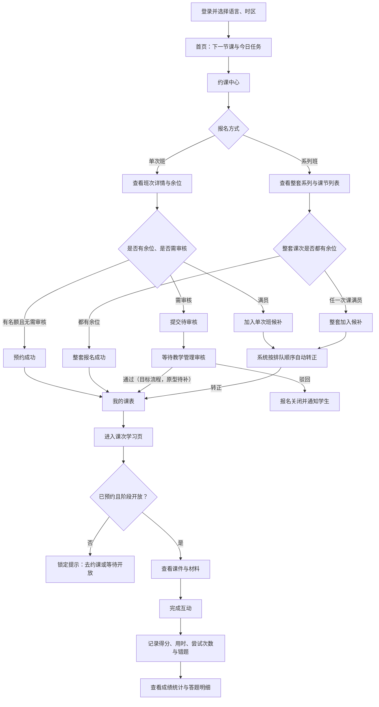

### 4.2 预约与候补状态机

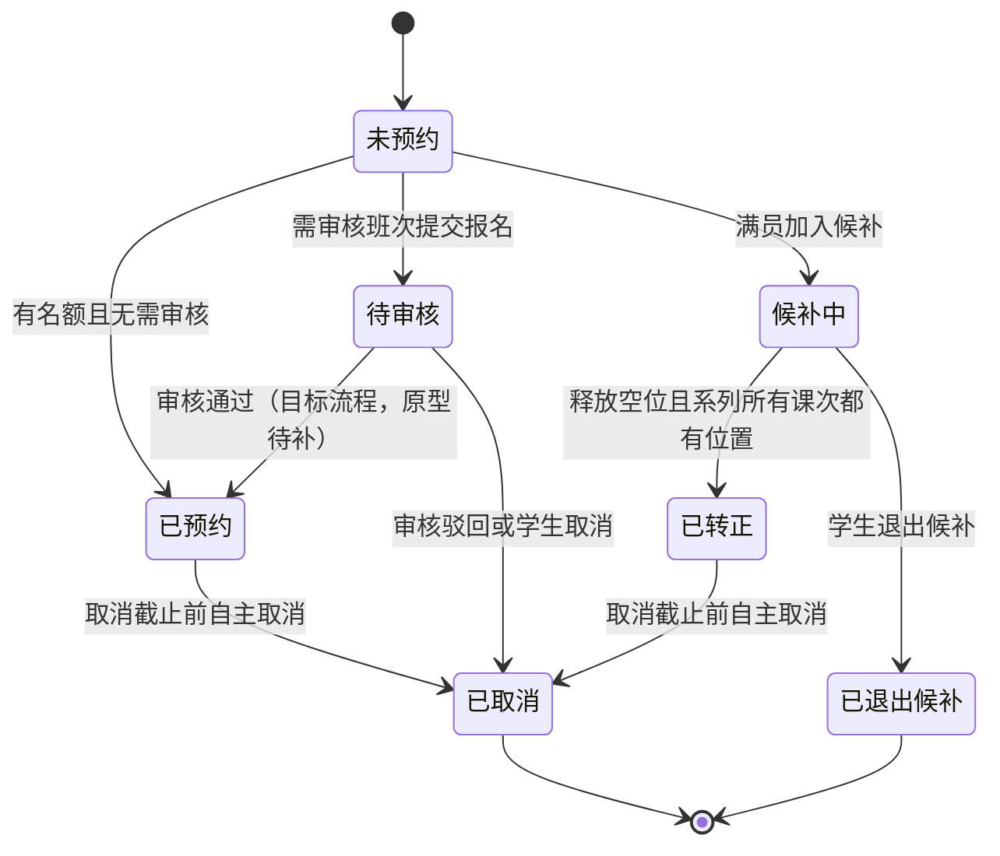

### 4.3 预约决策流程

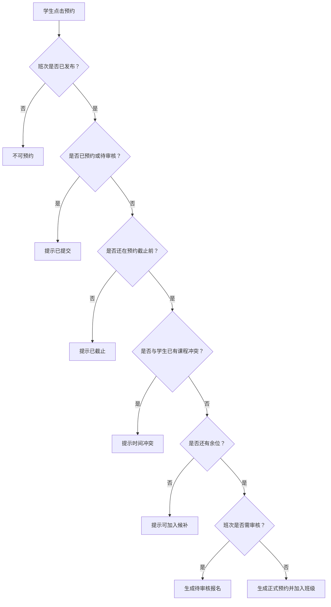

### 4.4 课节学习与互动作答流程

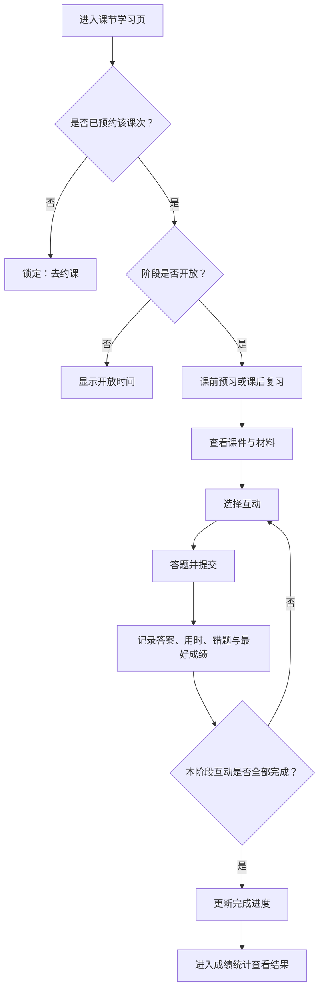

> 当前后台学生端的课中阶段在网页里隐藏，课中互动由移动端课堂页承载。

### 4.5 移动端课堂逐关完成流程

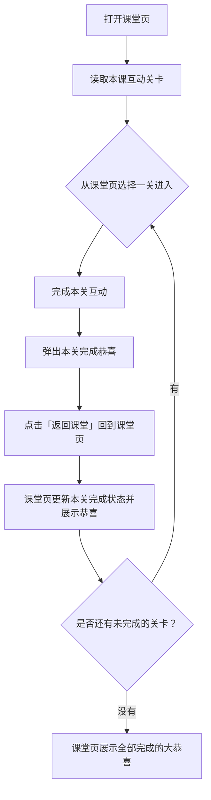

> 每完成一关都会回到课堂页：课堂页先更新该关的完成状态并给出恭喜，学生再从课堂页进入下一关；所有关卡完成后，课堂页再展示一次「全部完成啦」的总恭喜。当前课堂页读取本地试点课程数据，尚未接后台发布内容；接入后应由教师发布的互动决定关卡内容。

---

## 5. 教师角色流程图

### 5.1 教师主流程

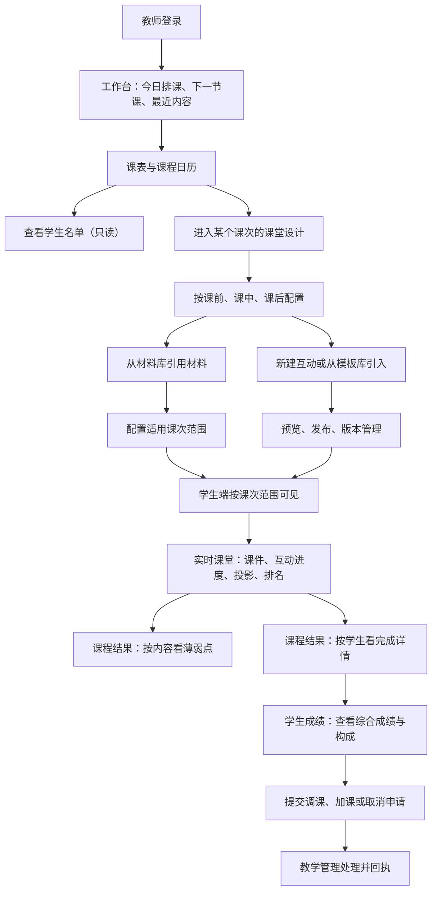

### 5.2 系列班创建流程（新口径）

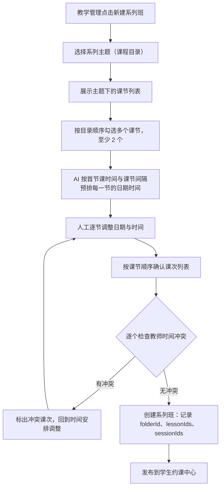

**规则说明**

- 一个课节在系列班里只出现一次，按目录顺序对应第 1 课、第 2 课……
- 每个课节生成一个课次；课次时间先由 AI 按「首节课时间 + 课节间隔」预排，人可以逐节调整日期和时间。
- 系列班的封面、颜色取第一个课节。
- 创建前统一检查教师时间冲突，冲突时回到时间安排调整，不会写入半套数据。
  
### 5.3 课堂设计与发布流程

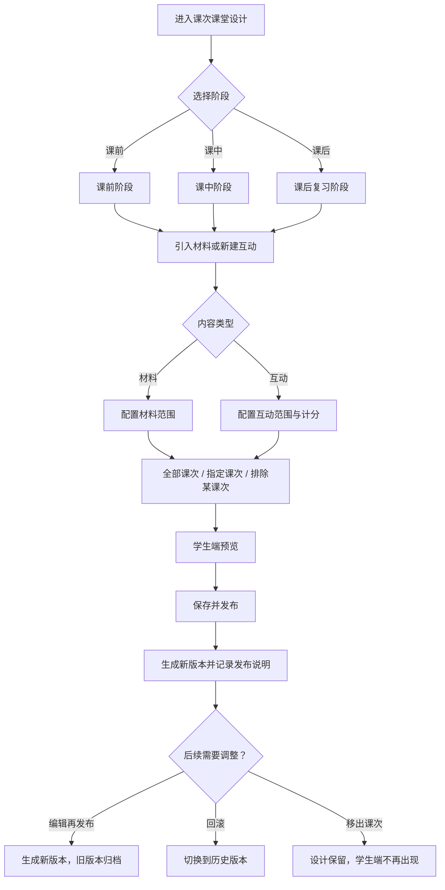

### 5.4 实时课堂流程

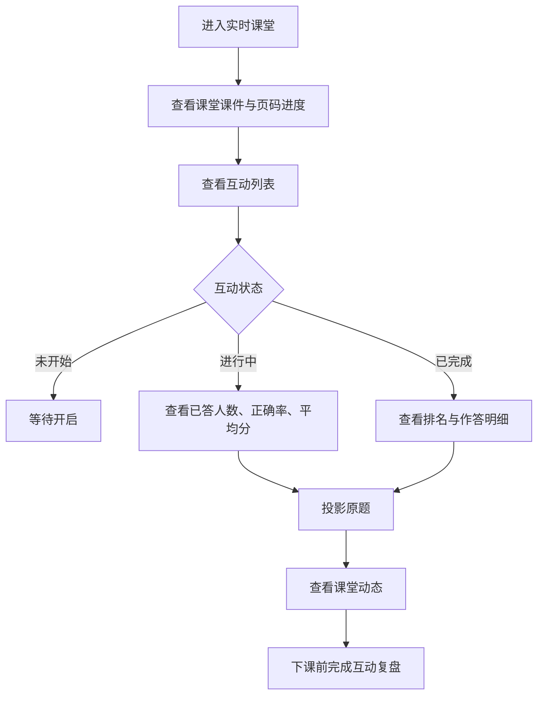

> 原型里的实时课堂数据由演示数据模拟；接入真实课堂后流程不变。

### 5.5 课程结果复盘流程

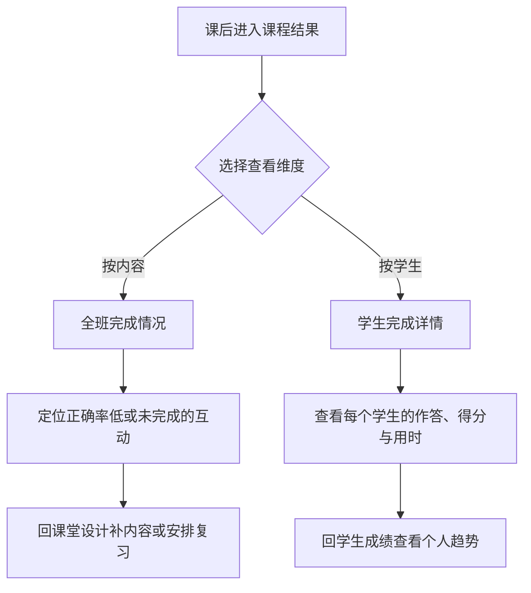

## 6. 跨角色流程图

### 6.1 从排课到上课（泳道图）

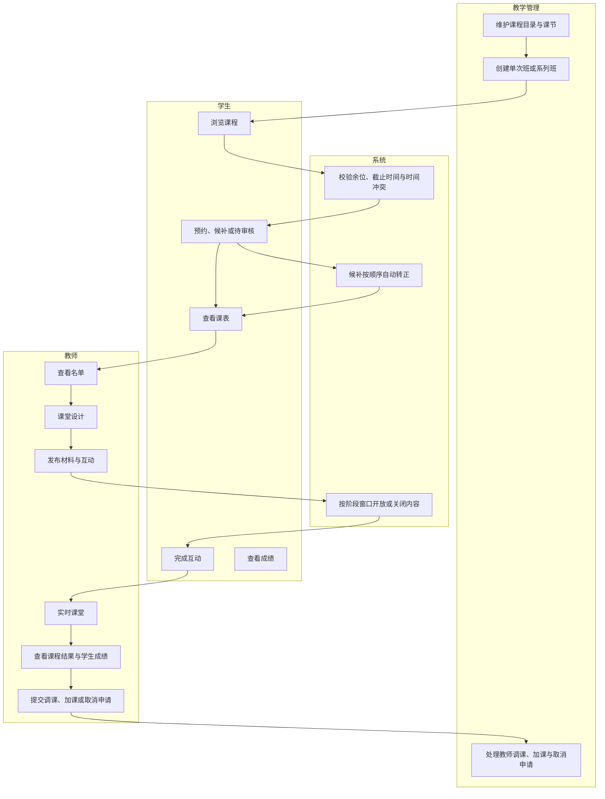

### 6.2 成绩闭环（泳道图）

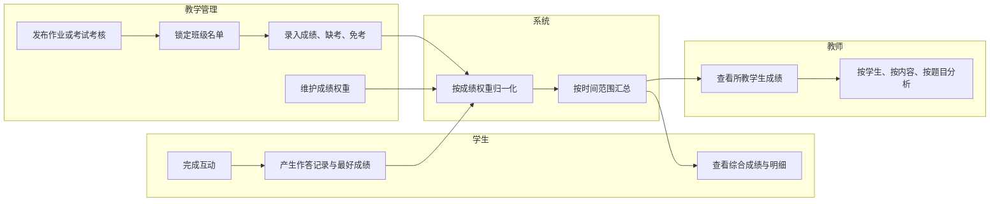

### 6.3 报名审核流程（目标流程）

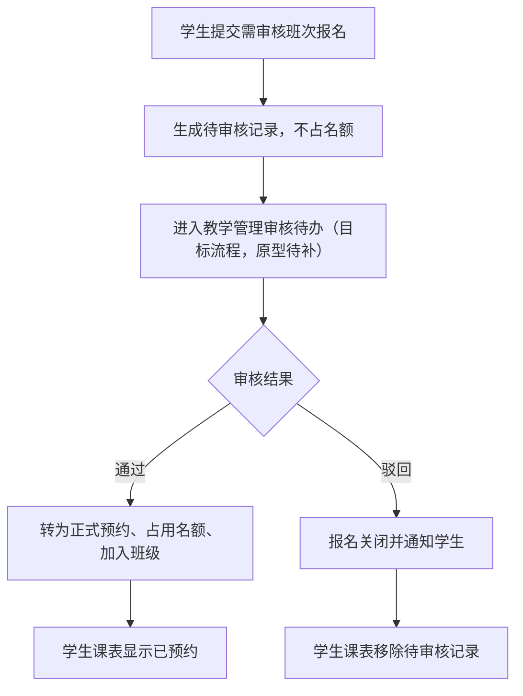

> 当前原型已实现学生端“待审核”状态，但教学管理端还没有专门的“审核通过/驳回”入口；可通过代理预约或取消记录变通处理。

### 6.4 教师调课申请流程

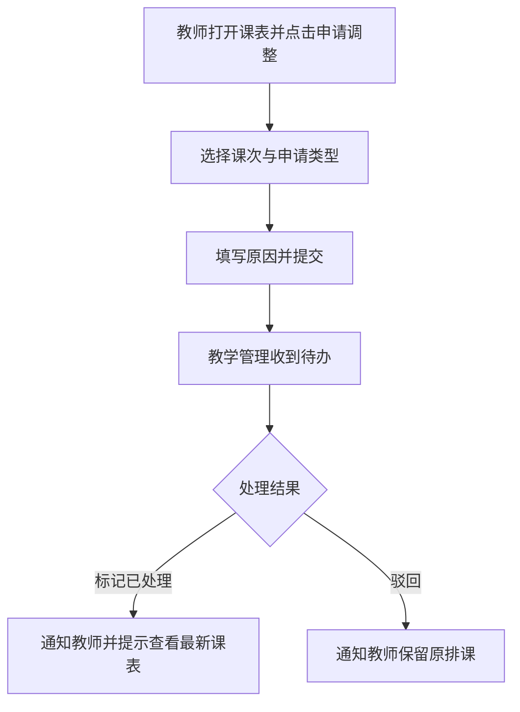

---

## 7. 功能清单（按界面）

### 7.1 移动学习端（原型页面）

| 模块 | 关键功能 | 状态 |
| --- | --- | --- |
| 首页与课堂入口 | 课程卡片、进入课堂互动 | ✅ |
| 课堂页 | 本课互动关卡、逐关完成返回与恭喜、全部完成总恭喜 | 🟡 本地试点数据 |
| 18 类互动页 | 各类题型作答与完成记账 | ✅ 前 14 类正式；后 4 类语音/开放题为占位 |
| 题型体验 | 不计分体验清单 | ✅ |
| 分享与反馈 | 反馈弹窗、文案 | ✅ |

### 7.2 后台学生视角

| 模块 | 关键功能 | 状态 |
| --- | --- | --- |
| 首页 | 下一节课、今日任务、学习统计 | ✅ |
| 约课中心 | 单次班、系列班、筛选、详情、预约、候补、待审核 | ✅ |
| 我的课表 | 即将开始、历史、候补、课程日历、取消预约 | ✅ |
| 课节学习 | 课前预习、课后复习、材料、互动、课件 | ✅ |
| 互动播放 | 18 类题型答题、提交、计分 | ✅；语音类为占位评分 |
| 成绩统计 | 综合成绩、分项、趋势、技能雷达、明细 | ✅ |

### 7.3 教师工作台

| 模块 | 关键功能 | 状态 |
| --- | --- | --- |
| 工作台 | 今日排课、下一节课、最近添加、统计 | ✅ |
| 课表与日历 | 未来、历史、全部、学生名单 | ✅ |
| 课堂设计 | 课前、课中、课后；材料与互动配置到课次 | ✅ |
| 材料库 | 课程材料、模板库、我的互动设计 | ✅ |
| 互动编辑 | 18 类题型、预览、发布、版本、回滚 | ✅ |
| 实时课堂 | 课件、互动进度、投影、排名、课堂动态 | 🟡 演示数据 |
| 课程结果 | 按内容、按学生复盘 | ✅ |
| 学生成绩 | 时间与班级筛选、学生汇总、分项、按题目查看 | ✅；录分入口当前在教学管理端 |
| 消息与申请 | 消息中心、调课、加课、取消申请 | ✅ |

### 7.4 教学管理后台

| 模块 | 关键功能 | 状态 |
| --- | --- | --- |
| 首页 | 课程供给与预约健康度 | ✅ |
| 课程目录 | 不限层级目录、课节创建 | ✅ |
| 排课管理 | 单次班、系列班（主题 + 多课节 + 逐节课次时间）、教师申请处理 | ✅ |
| 课次详情 | 名单、候补、代理预约、改期、取消、容量 | ✅ |
| 学生管理 | 档案、偏好、预约记录、成绩、考核发布与录分 | ✅ |
| 内容治理 | 互动回滚、材料下架与恢复 | ✅ |
| 操作日志 | 强制操作、回滚记录 | ✅ |

---

## 8. 当前原型与目标流程差异清单

| 项目 | 当前原型 | 目标流程 | 建议 |
| --- | --- | --- | --- |
| 报名审核 | 学生端有“待审核”状态；无审核通过/驳回入口 | 教学管理审核后转正式预约或关闭 | 补教学管理审核待办与通过/驳回动作 |
| 移动端课堂页 | 读取本地试点课程数据 | 教师发布后学生收到本课互动 | 接后台已发布互动集 |
| 实时课堂 | 演示数据模拟 | 真实课堂实时数据 | 接入真实作答流 |
| 教师录分 | 教学管理端创建考核并录入 | 是否由教师录分待确认 | 确认权限后决定是否补教师端入口 |
| 语音类互动 | 跟读、看图说话、开放问答为占位评分 | 真实录音、语音识别与评分 | 后续替换占位实现 |
| 主题定义 | 主题 = 课程目录 | 主题是否为独立维度待确认 | 若不同目录可同主题，需要新增主题字段 |
| 调课申请 | 已实现提交与教学管理处理闭环 | 正式业务规则与审批流 | 页面上仍有“一期不做”的旧注记，建议对齐文案 |

---

## 9. 图表清单（建议交付物）

| 图名 | 类型 | 用途 | 对应章节 |
| --- | --- | --- | --- |
| 核心层级关系图 | 层级图 | 讲清主题、课节、课次、系列班 | 1.2 |
| 用例总览图 | 流程图式用例图 | 三角色用例全景 | 3.1 |
| 学生主流程图 | 流程图 | 约课到成绩的完整链路 | 4.1 |
| 预约与候补状态机 | 状态图 | 讲清预约状态流转 | 4.2 |
| 预约决策流程图 | 流程图 | 讲清预约校验规则 | 4.3 |
| 课节学习与互动作答流程 | 流程图 | 讲清阶段、材料与互动 | 4.4 |
| 移动端课堂逐关完成流程 | 流程图 | 讲清每关完成返回课堂页的循环与总恭喜 | 4.5 |
| 教师主流程图 | 流程图 | 备课到复盘的完整链路 | 5.1 |
| 系列班创建流程图 | 流程图 | 新口径：主题 + 多课节 + AI 预排与人工调时间 | 5.2 |
| 课堂设计与发布流程 | 流程图 | 材料与互动如何配置到课次 | 5.3 |
| 实时课堂流程图 | 流程图 | 课中互动与数据查看 | 5.4 |
| 互动与材料状态机 | 状态图 | 发布、归档、回滚、下架 | 5.6 |
| 从排课到上课泳道图 | 泳道图 | 跨角色协作全景 | 6.1 |
| 成绩闭环泳道图 | 泳道图 | 互动与考核如何汇总成成绩 | 6.2 |
| 报名审核流程图 | 流程图 | 目标审核流程与缺口 | 6.3 |
| 教师调课申请流程图 | 流程图 | 申请与处理闭环 | 6.4 |

---

## 10. 待确认问题

1. “主题”是否独立于课程目录？如果不同目录下的课节也能归到同一主题，需要新增独立主题字段。
2. 同一个课节是否允许在同一个系列班里出现两次？当前实现是按顺序各出现一次。
3. 报名审核由谁审核、通过和驳回分别对应什么动作与通知？
4. 正式作业和考试的录分权限归教师还是教学管理？
5. 移动端课堂页何时接后台已发布互动？
6. 单次班是否可能包含多个课次？当前按单个课次报名。
7. 流程图颗粒度：是否需要每个用例单独一张图，还是保持本文的“主流程 + 关键分支”粒度？

---

*文档结束。所有 Mermaid 代码块可直接复制到支持 Mermaid 的 Markdown 编辑器渲染。*
